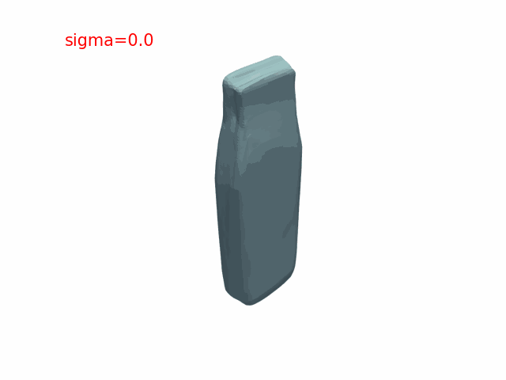
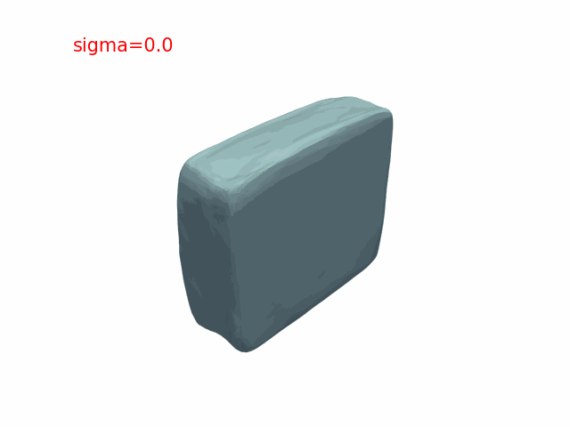

# Generative-Articulated-Object-s-

https://stackoverflow.com/questions/72110384/libgl-error-mesa-loader-failed-to-open-iris
```
sudo apt-get install libgl1-mesa-dri
```

## 准备数据集
 - `setup_dataset/gen.py`: 最原始的数据集 --> 格式化的数据，输出在 `setup_dataset/output`.
 - `point2sdf/convert2dataset.py`: 格式化的数据集 --> 可以被 pointnet-onet 训练的数据集，输入 `setup_dataset/output`，输出 `point2sdf/output`
 - `train.py`：训练 pointnet-onet，输入 `point2sdf/output`，拟合 part。

## 训练
```
python main.py -c configs/default.yaml
```

## 看点好的
./logs/interp_test/interp.gif


./logs/interp_test/usb-body-noise-higher.gif


./logs/interp_test/usb-cap-noise-higher.gif
